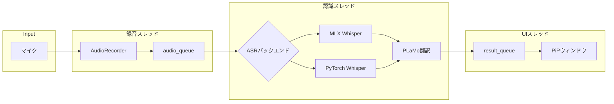
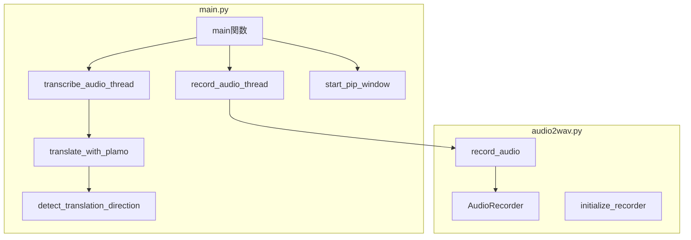
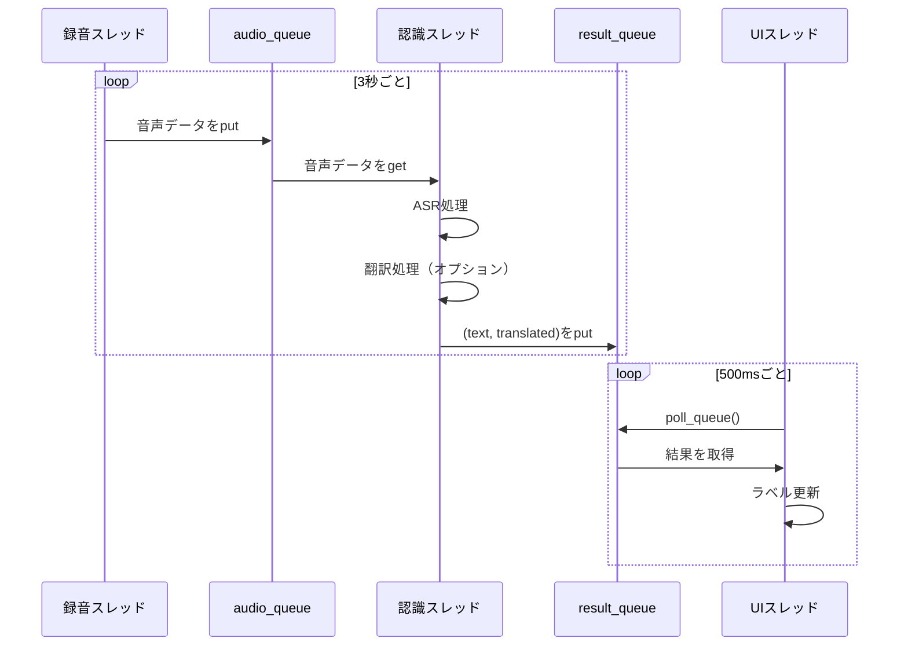
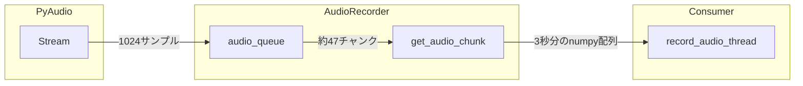

# asrivia アーキテクチャドキュメント

このドキュメントでは、asriviaの技術的な実装詳細について説明します。

## システム全体構成

### データフロー



### コンポーネント構成



## マルチスレッド設計

asriviaは3つのスレッドで並行処理を行います。

### スレッド構成

| スレッド | 役割 | 実行関数 |
|---------|------|---------|
| メインスレッド | UIイベントループ | `start_pip_window()` |
| 録音スレッド | 音声キャプチャ | `record_audio_thread()` |
| 認識スレッド | ASR処理・翻訳 | `transcribe_audio_thread()` |

### スレッド間通信



### 同期メカニズム

- **`queue.Queue`**: スレッドセーフなキューでデータを受け渡し
  - `audio_queue`: 録音→認識
  - `result_queue`: 認識→UI
- **`threading.Event`**: アプリケーション終了の通知
  - `stop_event`: UIスレッドからの終了シグナル

## ASRバックエンド詳細

### MLX Whisper（mlxバックエンド）

Apple Silicon Mac向けに最適化されたWhisper実装です。

```python
import mlx_whisper

# 言語指定あり
result = mlx_whisper.transcribe(
    audio_data,
    path_or_hf_repo="mlx-community/whisper-large-v3-turbo",
    language="ja"
)

# 言語自動判定
result = mlx_whisper.transcribe(
    audio_data,
    path_or_hf_repo="mlx-community/whisper-large-v3-turbo"
)
```

**特徴:**
- Metal GPUを活用した高速処理
- Hugging Faceからモデルを取得
- Apple Silicon専用

**利用可能なモデル:**
- `mlx-community/whisper-large-v3-turbo`（デフォルト）
- `mlx-community/whisper-large-v3`
- `mlx-community/whisper-medium`
- その他 `mlx-community/whisper-*` 系

### PyTorch Whisper（openaiバックエンド）

OpenAI公式のWhisper実装です。

```python
import whisper

# モデルのロード（初回はダウンロード）
model = whisper.load_model("large-v3-turbo")

# 言語指定あり
result = model.transcribe(audio_data, language="ja")

# 言語自動判定
result = model.transcribe(audio_data)
```

**特徴:**
- クロスプラットフォーム（Mac/Linux/Windows）
- ffmpegが必要
- 初回起動時にモデルをダウンロード

**利用可能なモデル:**
| モデル | パラメータ数 | 必要VRAM |
|-------|------------|---------|
| tiny | 39M | ~1GB |
| base | 74M | ~1GB |
| small | 244M | ~2GB |
| medium | 769M | ~5GB |
| large | 1550M | ~10GB |
| large-v2 | 1550M | ~10GB |
| large-v3 | 1550M | ~10GB |
| large-v3-turbo | - | ~6GB |

### ASR結果の形式

両バックエンドとも同じ形式で結果を返します。

```python
result = {
    "text": "認識されたテキスト",
    "language": "ja",  # 検出された言語
    # その他のメタデータ...
}
```

## 翻訳処理

### PLaMo CLI呼び出し

翻訳は`plamo-translate`コマンドラインツールを使用します。

```python
def translate_with_plamo(text, from_lang, to_lang):
    result = subprocess.run(
        [
            "plamo-translate",
            "--from", from_lang,  # "Japanese" or "English"
            "--to", to_lang,      # "English" or "Japanese"
            "--input", text
        ],
        stdout=subprocess.PIPE,
        stderr=subprocess.PIPE,
        timeout=10
    )
    return result.stdout.decode().strip()
```

### 言語コード変換

Whisperの言語コードとPLaMoの言語指定は形式が異なるため、変換が必要です。

```python
def detect_translation_direction(lang):
    if lang == "ja":
        return ("Japanese", "English")
    elif lang == "en":
        return ("English", "Japanese")
    else:
        return (None, None)
```

| Whisper | PLaMo (from) | PLaMo (to) |
|---------|-------------|-----------|
| `ja` | `Japanese` | `English` |
| `en` | `English` | `Japanese` |

### エラーハンドリング

- タイムアウト: 10秒
- エラー時は `[翻訳エラー]` を返す
- 標準エラー出力にエラー詳細をログ

## PiPウィンドウ実装

### tkinterによる常に最前面表示

```python
def start_pip_window(result_q, stop_ev):
    pip = tk.Toplevel()
    pip.title("asrivia")
    pip.geometry("500x110")

    # 常に最前面に表示
    pip.attributes("-topmost", True)
    pip.attributes("-alpha", 1.0)  # 不透明度
```

### ウィンドウ構成

```
+------------------------------------------+
|  認識結果テキスト                          |
|  → 翻訳結果（翻訳有効時）                   |
|                                          |
|              [－] [＋]                    |
+------------------------------------------+
```

- **text_label**: 認識結果と翻訳結果を表示
- **button_frame**: フォントサイズ調整ボタン

### 非同期更新の仕組み

```python
def poll_queue():
    try:
        while True:
            text, translated = result_q.get_nowait()
            if translated:
                text_label.config(text=f"{text}\n→ {translated}")
            else:
                text_label.config(text=text)
            result_q.task_done()
    except queue.Empty:
        pass

    if not stop_ev.is_set():
        pip.after(500, poll_queue)  # 500msごとにポーリング
    else:
        pip.destroy()
```

**ポイント:**
- `get_nowait()`: ブロックせずにキューから取得
- `pip.after(500, poll_queue)`: 500msごとに再実行
- `stop_ev`: ウィンドウ閉じたときに終了

### フォントサイズ調整

```python
font_size = tk.IntVar(value=14)

def change_font(delta):
    new_size = font_size.get() + delta
    new_size = max(8, min(32, new_size))  # 8〜32の範囲
    font_size.set(new_size)
    text_label.config(font=("Arial", new_size))
    translate_label.config(font=("Arial", max(8, new_size - 2)))
```

## 音声録音モジュール

### AudioRecorderクラス

`audio2wav.py`で定義される音声キャプチャクラスです。

```python
class AudioRecorder:
    def __init__(
        self,
        rate=16000,        # サンプリングレート（Whisper推奨値）
        chunk=1024,        # バッファサイズ
        channels=1,        # モノラル
        record_seconds=3   # 1チャンクあたりの録音秒数
    ):
        self.format = pyaudio.paFloat32  # 32bit浮動小数点
        self.audio_queue = queue.Queue()
        self.stop_event = threading.Event()
```

### バッファリングの仕組み



**計算:**
- サンプリングレート: 16000 Hz
- チャンクサイズ: 1024 サンプル
- 録音秒数: 3秒
- 必要チャンク数: `16000 / 1024 * 3 ≈ 47`

### 録音フロー

```python
def record_audio(self):
    pa = pyaudio.PyAudio()
    stream = pa.open(
        rate=self.rate,
        channels=self.channels,
        format=self.format,
        input=True,
        frames_per_buffer=self.chunk
    )

    while not self.stop_event.is_set():
        data = stream.read(self.chunk)
        # numpy配列に変換してキューに追加
        self.audio_queue.put(np.frombuffer(data, dtype=np.float32))
```

### グローバルレコーダー

シングルトンパターンでレコーダーを管理します。

```python
recorder = None

def initialize_recorder():
    global recorder
    if recorder is None:
        recorder = AudioRecorder()
        recorder.start_recording()

def record_audio():
    global recorder
    if recorder is None:
        initialize_recorder()
    return recorder.get_audio_chunk()
```

## ファイル構成

```
asrivia/
├── main.py           # メインアプリケーション
│   ├── translate_with_plamo()      # PLaMo翻訳
│   ├── detect_translation_direction()  # 言語方向判定
│   ├── record_audio_thread()       # 録音スレッド
│   ├── transcribe_audio_thread()   # 認識スレッド
│   ├── start_pip_window()          # PiPウィンドウ
│   └── main()                      # エントリポイント
│
├── audio2wav.py      # 音声録音モジュール
│   ├── AudioRecorder              # 録音クラス
│   ├── initialize_recorder()      # 初期化
│   ├── record_audio()             # 音声取得
│   └── cleanup()                  # クリーンアップ
│
├── pyproject.toml    # プロジェクト設定
├── README.md         # ユーザー向けドキュメント
└── docs/
    └── architecture.md  # このドキュメント
```

## 依存関係

### 必須

| パッケージ | バージョン | 用途 |
|-----------|-----------|------|
| mlx-whisper | >=0.4.2 | MLXバックエンド |
| pyaudio | >=0.2.14 | 音声入力 |

### オプション

| パッケージ | 用途 |
|-----------|------|
| openai-whisper | PyTorchバックエンド |
| torch | PyTorchバックエンド |
| plamo-translate | 翻訳機能 |

### システム依存

| ソフトウェア | 用途 |
|-------------|------|
| ffmpeg | PyTorchバックエンドの音声処理 |
